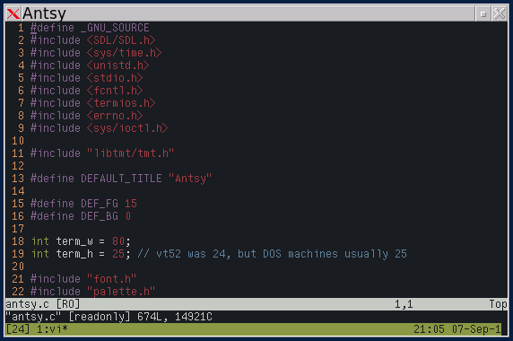

# Antsy Term

Antsy is a graphical terminal emulator that emulates an ANSI terminal with
a couple of extensions (notably, xterm-style window title setting and mouse
clicking work).

It utilizes Rob King's Tiny Mock Terminal Library (libtmt) -- or my fork of
it -- to do the actual terminal escape sequence parsing, and it uses SDL1
to do the rendering, input, etc.

## Features

* Very simple/lightweight
* Nice default font and color scheme
* All resources get compiled into the binary
* Good enough emulation for vim and tmux
* X10-style mouse support (works in vim)
* Simple dependencies (just SDL and the libtmt repository)
* Good for constrained systems (uses vfork() for systems with no MMU, uses
  only a single thread)

Antsy should be fairly portable.  It currently has been tested with Linux
and macOS (see the Building section for more on using it in macOS).

## Building

Antsy can be compiled either using the Rogo build system or using CMake.
These two options are detailed in the following subsections.

For simple scenarios, it can also be pretty trivially compiled entirely
by hand -- just compile `antsy.c` and `libtmt/tmt.c` and link them with
libSDL.)

With macOS, antsy takes a bit of effort if you're using Mojave because
of a bug in SDL that hasn't been fixed yet, but you can get it working
by either patching your SDL or building using an older version of the
macOS SDK.  If you use the Rogo build method, this is done for you
automatically.  If not, the easiest way to do it is to download Xcode
10.1 from Apple and use that to build it.

### Rogo

To compile Antsy using the Rogo build system, install Rogue 1.5.1 or better
from here:

[https://github.com/AbePralle/Rogue](https://github.com/AbePralle/Rogue)

Then execute the following to build Antsy on Ubuntu or macOS:

    rogo

### CMake

You need SDL 1.2.  On Ubuntu, `apt install libsdl1.2-dev` should do it.

You need cmake.  On Ubuntu, `apt install cmake` should do it.

You need libtmt.  `git clone https://github.com/MurphyMc/libtmt` should
do it.

Configure the project using `cmake .` or `ccmake .`  The stock libtmt
(if you're using it instead of Murphy's fork) will require you to set
the `ANTSY_TITLE_SET` option to False.

You should then be able to build with `cmake --build .`.

## Commandline options

* `-t TITLE` - Sets the initial window title
* `-e CMD ARGS...` - Run command instead of a shell (use as last argument)
* `-b MSEC` - Blink cursor every MSEC milliseconds
* `-d WxH` - Set window width and height (in characters)

## Fonts

The font is compiled in.  If you have an image file with a font you want
to use instead, convert it to a PNM (e.g., using ImageMagick), and then
use the included `makefont.py` script to generate a new `font.h`.

The included one is based on one of the X fonts (7x14 fixed width).  It's
my belief that this font is in the public domain.  Thanks go to Lars C.
Hassing for making it available in an easy-to-consume form.

## Palettes

The palette is compiled in.  It's just 16 RGB colors -- 8 "normal" colors
followed by 8 "bright" variations which are used for bold.  The included
palette is vim-hybrid by w0ng (https://github.com/w0ng/vim-hybrid), though
I got it from https://terminal.sexy.  If you want to make your own, it's
a nice tool for doing so.  Export it in Alacritty format, and it's then
pretty easy to put it into the right form for `palette.h`.
